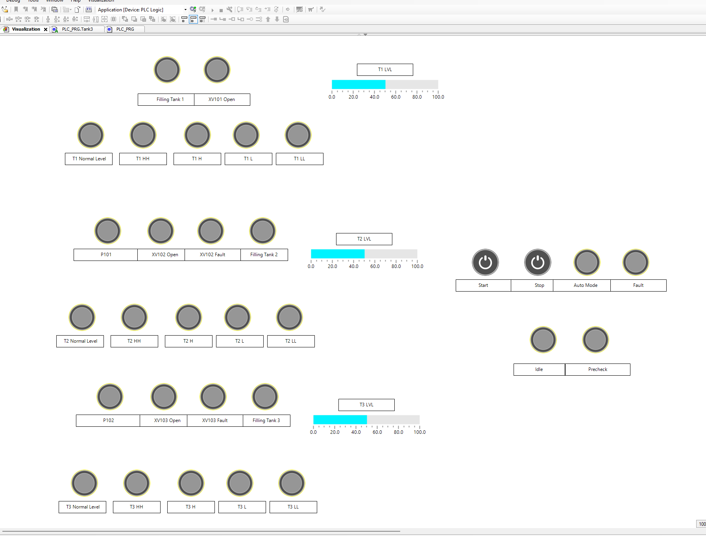
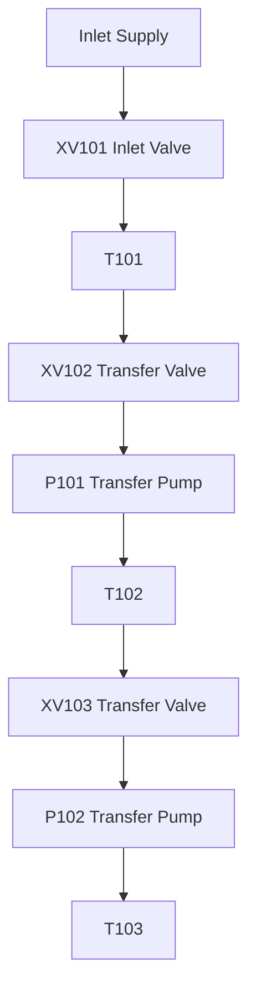
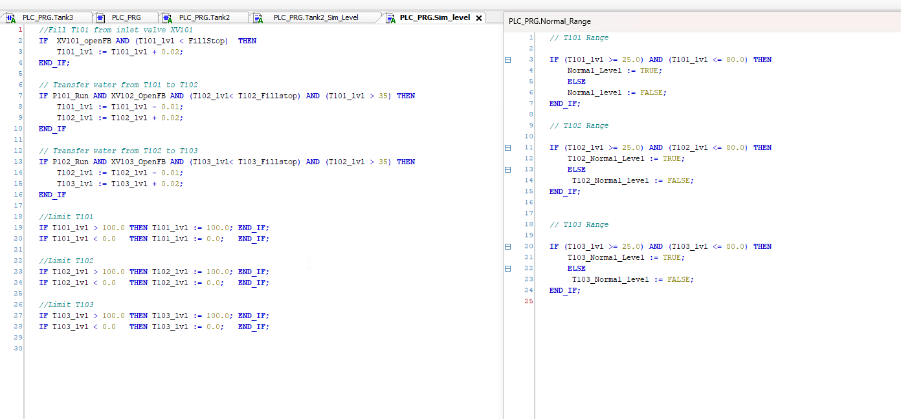
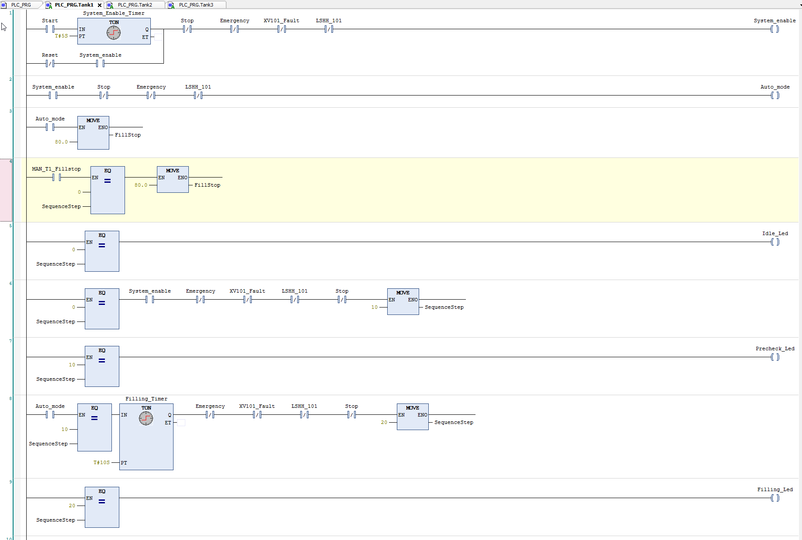
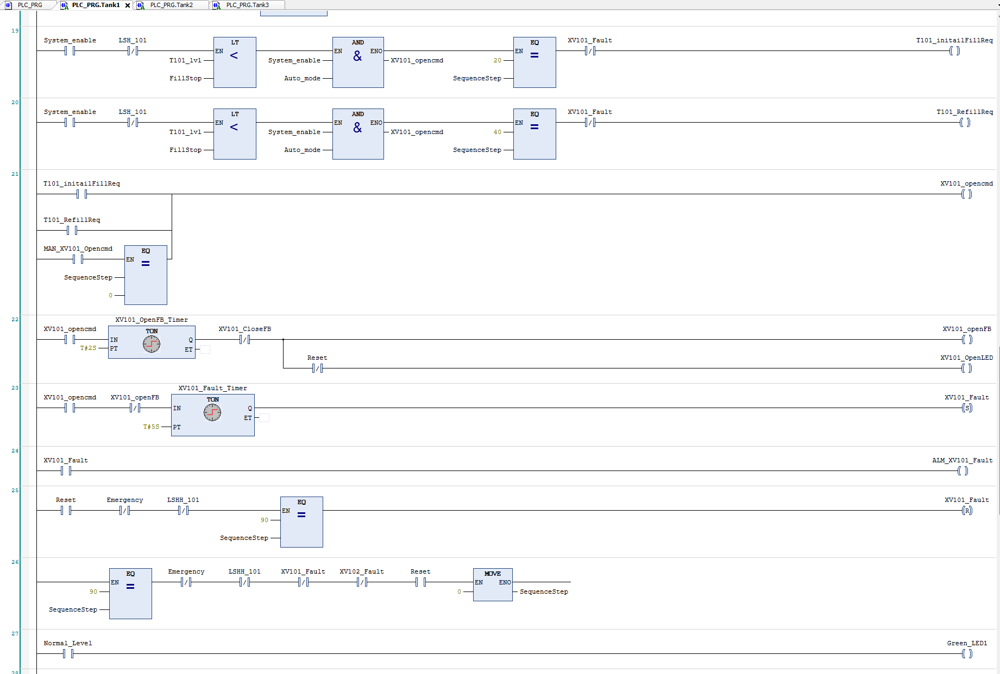
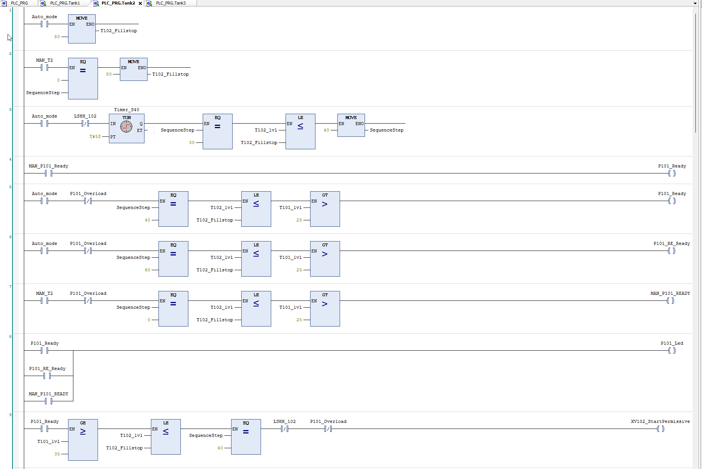
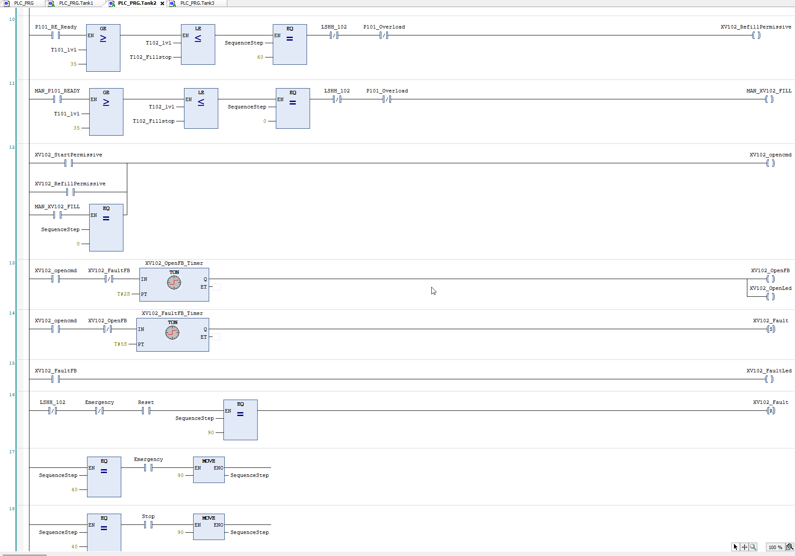
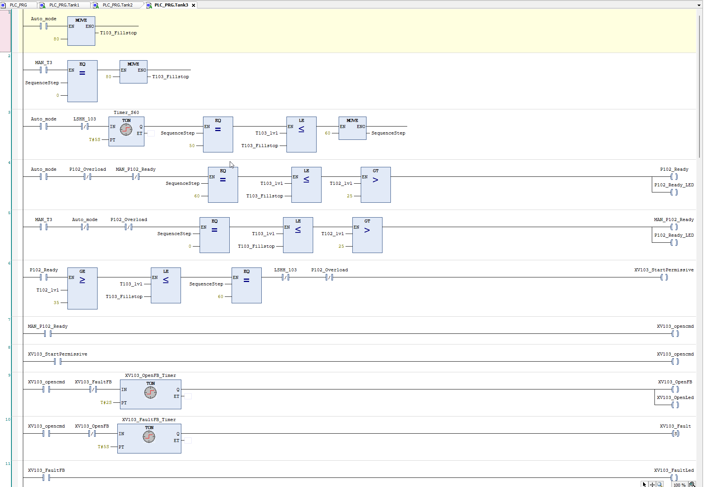
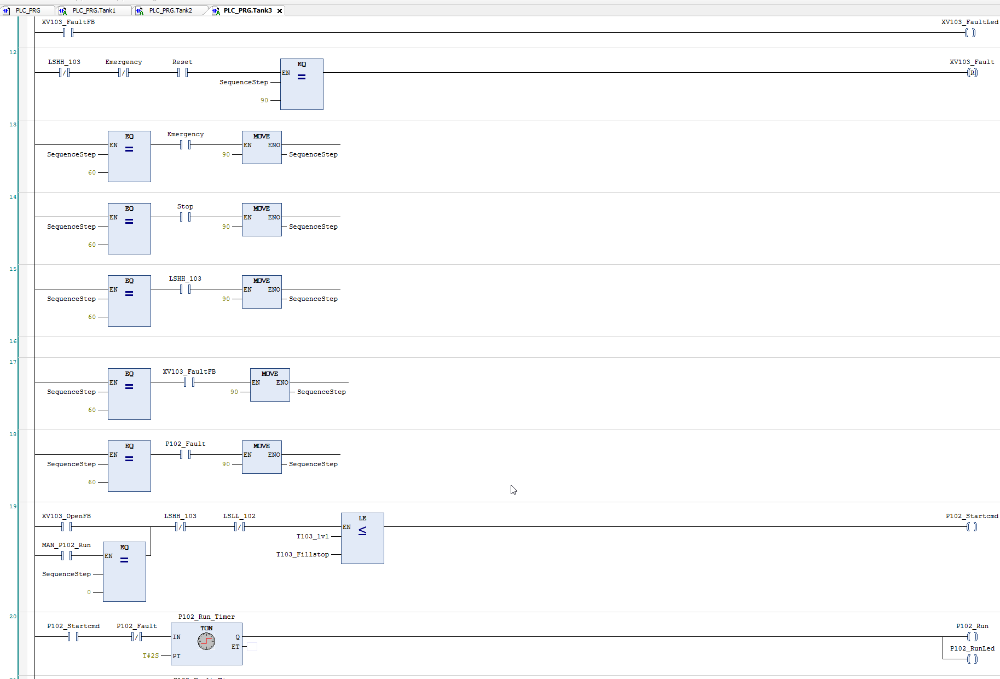

[README_FLAT.md](https://github.com/user-attachments/files/29299727/README_FLAT.md)
# Three-Tank Water Transfer System — CODESYS PLC/HMI V1 Simulation

**Status:** Functional V1 portfolio project
**Platform:** CODESYS
**Programming:** Ladder Diagram (LD), Structured Text (ST)
**HMI:** CODESYS Visualization
**Project type:** PLC/HMI process automation simulation

This repository contains a CODESYS-based PLC/HMI simulation of a three-tank
water-transfer process. The project demonstrates step-based sequence control,
pump and valve permissives, simulated device feedback, alarm/fault handling,
reset behavior, manual device control, and an HMI overview.



## Project Objective

The goal of this V1 project is to demonstrate practical PLC engineering thinking
in a simulated industrial process — not to claim a commissioned industrial
installation. The logic is structured around a realistic automation pattern:

```
Permissive -> Command -> Feedback -> Fault -> Alarm / Reset
```

## Tools Used

| Tool | Use |
|---|---|
| CODESYS | PLC programming and visualization platform |
| Ladder Diagram (LD) | Main sequence, interlocks, alarms, device logic |
| Structured Text (ST) | Tank-level simulation and range calculations |
| CODESYS Visualization | HMI overview for monitoring and operation |

## Process Description

The simulated system transfers water through three tanks:

1. T101 is filled through inlet valve XV101.
2. Water is transferred from T101 to T102 through XV102 using pump P101.
3. Water is transferred from T102 to T103 through XV103 using pump P102.
4. The process finishes when T103 reaches its fill setpoint.
5. Critical faults move the system to S90 Fault and require reset after the cause is cleared.



## Automatic Sequence

| Step | State | Description |
|---|---|---|
| S0  | Idle | Safe waiting state |
| S10 | Precheck | Initial checks before filling |
| S20 | Fill T101 | Open XV101 and fill Tank 101 |
| S30 | T101 Ready | Tank 101 reached filling setpoint |
| S40 | Transfer T101 to T102 | Open XV102 and run P101 |
| S50 | T102 Ready | Tank 102 reached filling setpoint |
| S60 | Transfer T102 to T103 | Open XV103 and run P102 |
| S70 | Complete | Process completed successfully |
| S90 | Fault | Fault state, reset required |

## Main Features

- Full automatic sequence from S0 to S70
- Fault state S90 with reset behavior
- Valve command, simulated open feedback, and missing-feedback fault logic
- Pump start command, simulated run feedback, and missing-run fault logic
- Tank high-high, high, low, and low-low indications
- Manual device-control concept for V1 testing
- ST-based analog tank-level simulation
- CODESYS Visualization HMI overview

## CODESYS Project File

The CODESYS project file is included at:

```
codesys/ThreeTank_WaterTransfer_CODESYS_V1.project
```

## HMI / Visualization

The HMI provides a one-screen overview of the process:

- Start / Stop / Auto Mode / Fault indication
- T101, T102, T103 level bars
- Pump and valve status indications
- Filling and transfer indicators
- Tank level alarm indicators
- Basic manual operation indicators

## Structured Text Simulation

Structured Text simulates the tank levels. The logic increases or decreases tank
levels based on valve and pump feedback states, then clamps all levels between
0% and 100%.



## Screenshots

**Tank 1 — sequence logic**


**Tank 1 — valve, feedback, and alarm logic**


**Tank 2 — transfer permissive logic**


**Tank 2 — valve/pump feedback logic**


**Tank 3 — transfer permissive logic**


**Tank 3 — pump/fault logic**


## Demo Video

A short demo of the running simulation (auto start → filling → transfers → fault/reset):

**Demo video:** 

https://github.com/user-attachments/assets/1f342805-5170-41db-9a4f-bd6626171fb8


## Note

This is a V1 **simulation** project for portfolio purposes — it demonstrates
practical PLC development and industrial automation thinking, and is not a final
commissioning package.

---

**Project by:** Mohammad Hamdan — PLC programming, automation engineering, CODESYS, industrial control logic
